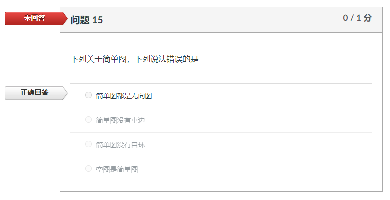
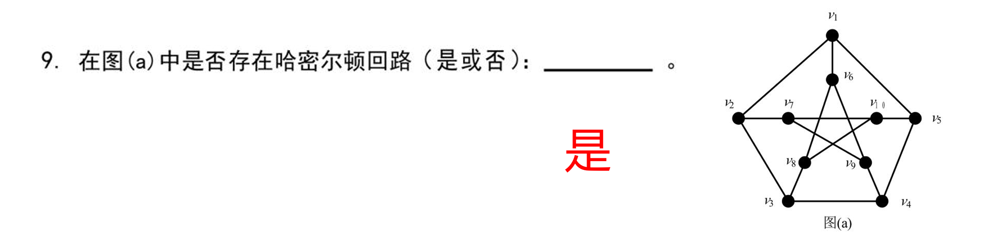
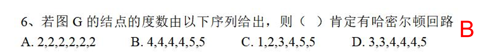
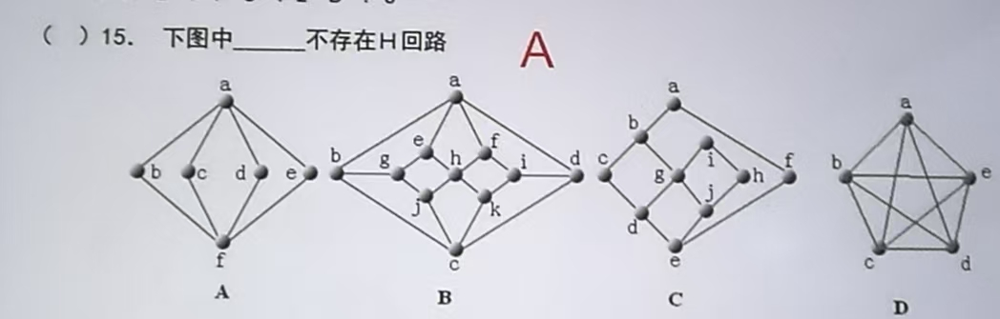
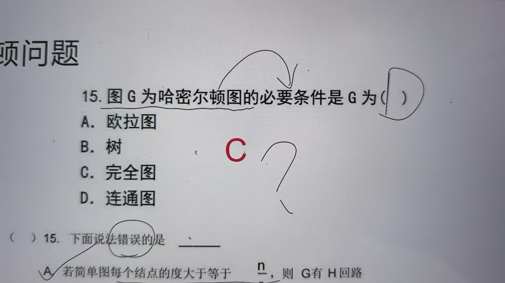

# 2025年秋离散数学课程网站

## 课程通知 / News
- 2025/9/23：欢迎开始**离散数学（CS2501-02）**的学习！
- 2025/10/16：图论测验安排在10月20日（周一），以随堂考试的方式进行。考试一共五道单选，五道多选，五道填空，五道大题，一共 20 题。

## 课程材料 / Material

| 章节            | 课件                                                         |
| --------------- | ------------------------------------------------------------ |
| 图论第一章 |[Lecture 1 离散数学-图论-Chapter01.pdf](./PDF_Slides/离散数学-图论-Chapter01.pdf)|
| 图论第二章|[Lecture 2 离散数学-图论-Chapter02.pdf](./PDF_Slides/离散数学-图论-Chapter02.pdf)|
| 图论第三章|[Lecture 3 离散数学-图论-Chapter03.pdf](./PDF_Slides/离散数学-图论-Chapter03.pdf)|
| 数理逻辑第一章|[Lecture 4 离散数学-数理逻辑-Chapter01.pdf](./PDF_Slides/离散数学chapter01.pdf)|
| 数理逻辑第二章|[Lecture 5 离散数学-数理逻辑-Chapter02.pdf](./PDF_Slides/离散数学chapter02.pdf)|
| 数理逻辑第四章|[Lecture 6 离散数学-数理逻辑-Chapter04.pdf](./PDF_Slides/离散数学chapter04.pdf)|
| 数理逻辑第五章|[Lecture 7 离散数学-数理逻辑-Chapter05.pdf](./PDF_Slides/离散数学chapter05.pdf)|
| 集合论第九章|[Lecture 8 离散数学-集合论-Chapter09.pdf](./PDF_Slides/第九章_集合论.pdf)|第九章_集合论
| 集合论第十章|      |
| 集合论第十一章 |      |
| 复习                    |      |

## 作业 / Homework
1.图论第一章作业：《图论与代数结构(第2版)》P13: 1,2,4,7,10,16(邻接矩阵、关联矩阵),17。截止时间：9月28日  
2.图论第二章作业：《图论与代数结构(第2版)》P50: 1,2, 3, 4,11,18,20,25。截止时间：10月12日  
3.图论第三章作业：《图论与代数结构(第2版)》P82: 1,2, 4,32,33, 39,40,44。截止时间：10月12日  
4.数理逻辑第一章作业：《数理逻辑与集合论（第2版）》P12: 1(2,4,6,8), 4(2,4,6), 5(2,4,6,8), 6(2)。截止时间：10月19日  
5.数理逻辑第二章作业：《数理逻辑与集合论（第2版）》P37: 1(1,3),2,3,4(2),5(8),7(10,11),8(4,5,6), 9(1),12(1)  
6.数理逻辑第四章作业：《数理逻辑与集合论（第2版）》P66: 1(1,2,4,6,8,9),2(3),3(2,3),4(2),5(2,4,6,8,10),7(10),8(2,4,6,7), 10(1,3,5,7)  

## 习题课 / 随堂测试 / Exam

### 补充题

- [图论第一章 补充题](./PDF_Slides/离散数学-图论-Chapter01-Exercises.pdf)
- [图论第二章 补充题](./PDF_Slides/离散数学-图论-Chapter02-Exercises.pdf)
- [图论第三章 补充题](./PDF_Slides/离散数学-图论-Chapter03-Exercises.pdf)

## 勘误

1.Canvas上的单元复习题：系统在出题的时候任务简单图包含有向图。教材上的定义是简单图为无向图，按照教材定义本题无可选项。**后续以教材上的定义为准**。

2.图论第二章课后作业第二十五题：若 $\|X\|-\|Y\| \ge 1$，则一定没有哈密顿路径。更改为：若 $\|X\|-\|Y\| > 1$，则一定没有哈密顿路径。
3.图论第二章补充题，由穷举法可知不存在H回路

4.图论第二章补充题，从Dirac定理来看，BD都可以
 
5.完全二叉树的定义以PPT上讲的为准  
6.AB都不存在H回路

7.必要条件是D

